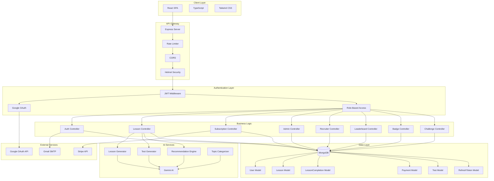

# DXTalent

<div align="center">


[](https://nodejs.org)
[](https://reactjs.org)
[](https://www.mongodb.com)
[](https://www.typescriptlang.org)

**Enterprise-grade gamified learning management system with AI-powered content generation**

[Live Demo](https://dxtalent.vercel.app/) • [API Documentation](docs/API_DOCUMENTATION.md) • [Report Bug](https://github.com/dipandhali2021/DXTalent/issues) • [Request Feature](https://github.com/dipandhali2021/DXTalent/issues)

</div>

---

## Overview

DXTalent is an AI-powered learning platform that uses gamification to build skills and connects top talent with recruiters via a built-in marketplace. Our motto: "Aiming to discover and recognize motivated talent."


### Core Capabilities

- **AI Content Generation**: Automated lesson creation powered by Google Gemini 2.0
- **Gamification Engine**: XP system, achievement badges, league progression, and daily streaks
- **Analytics Dashboard**: Real-time performance tracking and insights
- **Talent Marketplace**: Recruiter access to learner profiles and skill assessments
- **Multi-tenant Architecture**: Separate dashboards for learners, recruiters, and administrators

---

## Table of Contents

- [Technology Stack](#technology-stack)
- [Architecture](#architecture)
- [Installation](#installation)
- [API Documentation](#api-documentation)
- [Database Schema](#database-schema)
- [Security](#security)
- [Deployment](#deployment)
- [Contributing](#contributing)
- [License](#license)

---

## Technology Stack

### Backend
- **Runtime**: Node.js 20+
- **Framework**: Express.js 5
- **Database**: MongoDB 8 with Mongoose ODM
- **Authentication**: JWT + OAuth 2.0 (Google)
- **Payment Processing**: Stripe
- **AI Integration**: Google Gemini 2.0
- **Email Service**: Nodemailer
- **Security**: Helmet.js, Rate Limiter, bcrypt

### Frontend
- **Framework**: React 18.3 with TypeScript 5.5
- **Build Tool**: Vite 5.4
- **UI Library**: shadcn/ui + Radix UI
- **Styling**: Tailwind CSS 3.4
- **State Management**: TanStack Query
- **Routing**: React Router v6
- **Animations**: Framer Motion

---

## Architecture

### System Overview



---

## Installation

### Prerequisites

- Node.js 20+
- MongoDB 6+
- Git
- Gmail account (for email verification)
- Stripe account (for payment processing)
- Google Cloud project (for OAuth and Gemini AI)

### Setup

#### 1. Clone Repository

```bash
git clone https://github.com/dipandhali2021/DXTalent.git
cd DXTalent
```

#### 2. Install Dependencies

```bash
# Backend
cd server
npm install

# Frontend
cd ../client
npm install
```

#### 3. Configure Environment Variables

**Backend** (`server/.env`):

```env
# Database
MONGODB_URI=mongodb://localhost:27017/dxtalent

# Server
PORT=5000
NODE_ENV=development
FRONTEND_URL=http://localhost:8080

# JWT
JWT_ACCESS_SECRET=your_access_secret_32_chars
JWT_REFRESH_SECRET=your_refresh_secret_32_chars

# Email (Gmail SMTP)
EMAIL_HOST=smtp.gmail.com
EMAIL_PORT=587
EMAIL_SECURE=false
EMAIL_USER=your-email@gmail.com
EMAIL_PASSWORD=your-gmail-app-password
EMAIL_FROM=DXTalent <your-email@gmail.com>

# Google Gemini AI
GEMINI_API_KEY=your_gemini_api_key

# Stripe
STRIPE_SECRET_KEY=sk_test_...
STRIPE_WEBHOOK_SECRET=whsec_...
STRIPE_PRICE_PRO_LEARNER=price_...
STRIPE_PRICE_RECRUITER=price_...
STRIPE_PRICE_ADDON=price_...

# Google OAuth
GOOGLE_CLIENT_ID=your_google_client_id
GOOGLE_CLIENT_SECRET=your_google_client_secret
```

**Frontend** (`client/.env`):

```env
VITE_API_URL=http://localhost:5000/api
VITE_GOOGLE_CLIENT_ID=your_google_client_id
```

#### 4. Start Development Servers

**Backend:**

```bash
cd server
npm run dev
```

**Frontend:**

```bash
cd client
npm run dev
```

Access application at: `http://localhost:8080`

---

## API Documentation

### Authentication Endpoints

| Method | Endpoint | Description | Access |
|--------|----------|-------------|--------|
| POST | `/api/auth/register` | Register new user | Public |
| POST | `/api/auth/login` | User login | Public |
| POST | `/api/auth/google` | Google OAuth login | Public |
| GET | `/api/auth/verify/:token` | Email verification | Public |
| POST | `/api/auth/forgot-password` | Request password reset | Public |
| POST | `/api/auth/reset-password/:token` | Reset password | Public |
| POST | `/api/auth/refresh` | Refresh access token | Public |
| POST | `/api/auth/logout` | User logout | Authenticated |

### Lesson Endpoints

| Method | Endpoint | Description | Access |
|--------|----------|-------------|--------|
| GET | `/api/lessons` | Get all lessons | Authenticated |
| GET | `/api/lessons/:id` | Get lesson by ID | Authenticated |
| POST | `/api/lessons/generate` | Generate AI lessons (1 credit) | Authenticated |
| POST | `/api/lessons/:id/generate-content` | Generate placeholder content (0.5 credit) | Authenticated |
| GET | `/api/lessons/category/:category` | Get lessons by category | Authenticated |
| GET | `/api/lessons/recommended` | Get recommended lessons | Authenticated |
| GET | `/api/lessons/next` | Get next lesson | Authenticated |

### Test Endpoints

| Method | Endpoint | Description | Access |
|--------|----------|-------------|--------|
| GET | `/api/lessons/:lessonId/test` | Get test for lesson | Authenticated |
| POST | `/api/lessons/:lessonId/test/submit` | Submit test answers | Authenticated |

### User Endpoints

| Method | Endpoint | Description | Access |
|--------|----------|-------------|--------|
| GET | `/api/auth/me` | Get current user profile | Authenticated |
| PUT | `/api/auth/profile` | Update user profile | Authenticated |
| GET | `/api/auth/stats` | Get user statistics | Authenticated |

### Leaderboard Endpoints

| Method | Endpoint | Description | Access |
|--------|----------|-------------|--------|
| GET | `/api/leaderboard` | Get global leaderboard | Authenticated |
| GET | `/api/leaderboard/top` | Get top 10 users | Public |

### Badge Endpoints

| Method | Endpoint | Description | Access |
|--------|----------|-------------|--------|
| GET | `/api/badges` | Get all available badges | Authenticated |
| GET | `/api/badges/user/:userId` | Get user badges | Authenticated |

### Subscription Endpoints

| Method | Endpoint | Description | Access |
|--------|----------|-------------|--------|
| POST | `/api/subscriptions/create-checkout` | Create Stripe checkout | Authenticated |
| POST | `/api/subscriptions/webhook` | Stripe webhook | Public |
| GET | `/api/subscriptions/status` | Get subscription status | Authenticated |

### Recruiter Endpoints

| Method | Endpoint | Description | Access |
|--------|----------|-------------|--------|
| GET | `/api/recruiter/candidates` | Get all candidates | Recruiter |
| GET | `/api/recruiter/candidates/:userId` | Get candidate details | Recruiter |
| GET | `/api/recruiter/dashboard` | Get recruiter dashboard | Recruiter |

### Admin Endpoints

| Method | Endpoint | Description | Access |
|--------|----------|-------------|--------|
| GET | `/api/admin/dashboard` | Get admin dashboard | Admin |
| GET | `/api/admin/users` | Get all users | Admin |
| PUT | `/api/admin/users/:id/role` | Update user role | Admin |
| PUT | `/api/admin/users/:id/status` | Suspend/activate user | Admin |
| GET | `/api/admin/payments` | Get all payments | Admin |

---


---

## Security

### Authentication & Authorization
- JWT-based authentication with access and refresh tokens
- OAuth 2.0 integration (Google)
- bcrypt password hashing (10 rounds)
- Role-based access control (RBAC)
- Email verification required
- Password reset with time-limited tokens

### API Security
- Rate limiting on all endpoints
- CORS configuration with origin whitelist
- Helmet.js security headers
- Input validation and sanitization
- XSS protection
- MongoDB injection prevention

### Data Protection
- Environment variables for sensitive data
- httpOnly cookies for token storage
- Secure password reset mechanism
- Account lockout after failed attempts

---

## Deployment

### Backend (Node.js)

**Vercel Deployment:**

1. Push code to GitHub
2. Import project in Vercel
3. Configure environment variables
4. Deploy

**Environment Variables Required:**
- `MONGODB_URI`
- `JWT_ACCESS_SECRET`
- `JWT_REFRESH_SECRET`
- `GEMINI_API_KEY`
- `STRIPE_SECRET_KEY`
- `EMAIL_USER`
- `EMAIL_PASSWORD`
- `GOOGLE_CLIENT_ID`
- `GOOGLE_CLIENT_SECRET`

### Frontend (React)

**Vercel Deployment:**

1. Push code to GitHub
2. Import project in Vercel
3. Set build command: `npm run build`
4. Set output directory: `dist`
5. Configure environment variables:
   - `VITE_API_URL`
   - `VITE_GOOGLE_CLIENT_ID`

### Database

**MongoDB Atlas:**
1. Create cluster on MongoDB Atlas
2. Configure network access
3. Create database user
4. Get connection string
5. Add to `MONGODB_URI` environment variable

---

## Contributing

We welcome contributions! Please follow these guidelines:

1. Fork the repository
2. Create a feature branch (`git checkout -b feature/your-feature`)
3. Commit changes (`git commit -m 'Add your feature'`)
4. Push to branch (`git push origin feature/your-feature`)
5. Open a Pull Request

### Development Guidelines
- Follow existing code style
- Write clear commit messages
- Add tests for new features
- Update documentation as needed
- Ensure all tests pass before submitting PR

---


**Built with ❤️**
