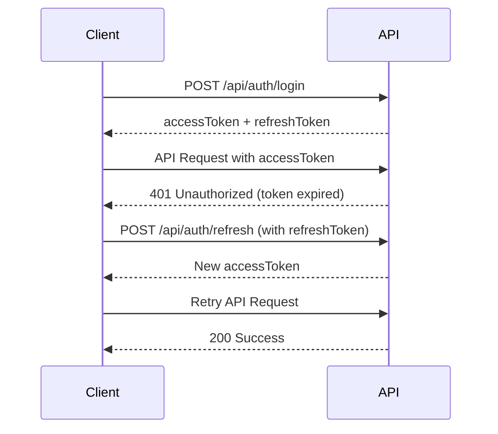

# 📡 DXTalent API Documentation

<div align="center">


**Complete REST API documentation for the DXTalent Learning Platform**

[🚀 Live API](#) • [📬 Postman Collection](DXTalent_Complete_API_Collection.postman_collection.json) • [🐛 Report Issue](#)

</div>

---

## 📑 Table of Contents

- [Overview](#-overview)
- [Base URL](#-base-url)
- [Authentication](#-authentication)
- [Rate Limiting](#-rate-limiting)
- [Error Handling](#-error-handling)
- [API Endpoints](#-api-endpoints)
  - [Health Check](#health-check)
  - [Authentication](#authentication-endpoints)
  - [Lessons](#lessons-endpoints)
  - [Leaderboard](#leaderboard-endpoints)
  - [Challenges](#challenges-endpoints)
  - [Badges](#badges-endpoints)
  - [Recruiter](#recruiter-endpoints)
  - [Subscriptions](#subscriptions-endpoints)
  - [Seed](#seed-endpoints)
  - [Admin](#admin-endpoints)
- [Postman Collection](#-postman-collection)

---

## 🌐 Overview

The DXTalent API is a RESTful API that provides access to all platform features including:

- **User Authentication** with JWT tokens
- **AI-Powered Lesson Generation** using Google Gemini
- **Gamification Features** (XP, badges, leagues, streaks)
- **Real-time Leaderboards** with league progression
- **Payment Processing** via Stripe
- **Admin Dashboard** with comprehensive analytics
- **Recruiter Tools** for talent discovery

---

## 🔗 Base URL

```
Development:  http://localhost:5000/api
Production:   https://dxtalent-server.vercel.app/api
```

---

## 🔐 Authentication

### JWT Bearer Token

Most endpoints require authentication using JWT tokens. Include the access token in the `Authorization` header:

```http
Authorization: Bearer <your_access_token>
```

### Token Types

1. **Access Token**: Short-lived (15 minutes), used for API requests
2. **Refresh Token**: Long-lived (7 days), used to obtain new access tokens

### Token Refresh Flow



---

## ⏱️ Rate Limiting

Rate limits are applied per IP address to prevent abuse:

| Endpoint Type  | Rate Limit   | Window     |
| -------------- | ------------ | ---------- |
| Authentication | 5 requests   | 15 minutes |
| Login          | 10 requests  | 15 minutes |
| Registration   | 5 requests   | 1 hour     |
| Password Reset | 3 requests   | 1 hour     |
| General API    | 100 requests | 15 minutes |

**Response Headers:**

```
X-RateLimit-Limit: 100
X-RateLimit-Remaining: 95
X-RateLimit-Reset: 1635724800
```

---

## ❌ Error Handling

### Standard Error Response

```json
{
  "success": false,
  "message": "Error message description",
  "errors": [
    {
      "field": "email",
      "message": "Email is required"
    }
  ]
}
```

### HTTP Status Codes

| Code | Description                             |
| ---- | --------------------------------------- |
| 200  | Success                                 |
| 201  | Created                                 |
| 400  | Bad Request - Invalid input             |
| 401  | Unauthorized - Invalid or missing token |
| 403  | Forbidden - Insufficient permissions    |
| 404  | Not Found - Resource doesn't exist      |
| 409  | Conflict - Duplicate resource           |
| 423  | Locked - Account locked                 |
| 429  | Too Many Requests - Rate limit exceeded |
| 500  | Internal Server Error                   |

---

## 🚀 API Endpoints

## Health Check

### Get Server Status

Check if the API server is running.

```http
GET /health
```

**Response:**

```json
{
  "success": true,
  "message": "Server is running",
  "timestamp": "2024-11-06T10:30:00.000Z"
}
```

### Get API Information

Get API version and available endpoints.

```http
GET /
```

**Response:**

```json
{
  "success": true,
  "message": "DXTalent API Server",
  "version": "1.0.0",
  "endpoints": {
    "auth": "/api/auth",
    "lessons": "/api/lessons",
    "leaderboard": "/api/leaderboard",
    "health": "/health"
  }
}
```

---

## Authentication Endpoints

### Register User

Create a new user account.

```http
POST /api/auth/register
Content-Type: application/json
```

**Request Body:**

```json
{
  "username": "johndoe",
  "email": "john@example.com",
  "password": "SecurePass123!",
  "role": "user"
}
```

**Response: 201 Created**

```json
{
  "success": true,
  "message": "Registration successful! Please check your email to verify your account.",
  "data": {
    "user": {
      "id": "507f1f77bcf86cd799439011",
      "username": "johndoe",
      "email": "john@example.com",
      "role": "user",
      "isEmailVerified": false
    }
  }
}
```

### Login

Authenticate user and receive tokens.

```http
POST /api/auth/login
Content-Type: application/json
```

**Request Body:**

```json
{
  "email": "john@example.com",
  "password": "SecurePass123!"
}
```

**Response: 200 OK**

```json
{
  "success": true,
  "message": "Login successful",
  "data": {
    "user": {
      "id": "507f1f77bcf86cd799439011",
      "username": "johndoe",
      "email": "john@example.com",
      "role": "user",
      "xp": 1500,
      "level": 5,
      "league": "silver",
      "streak": 7
    },
    "accessToken": "eyJhbGciOiJIUzI1NiIsInR5cCI6IkpXVCJ9...",
    "refreshToken": "eyJhbGciOiJIUzI1NiIsInR5cCI6IkpXVCJ9..."
  }
}
```

### Google OAuth

Authenticate using Google OAuth credentials.

```http
POST /api/auth/google
Content-Type: application/json
```

**Request Body:**

```json
{
  "credential": "google_oauth_credential_token",
  "email": "john@gmail.com",
  "name": "John Doe",
  "picture": "https://lh3.googleusercontent.com/..."
}
```

### Verify Email

Verify user email with verification token.

```http
GET /api/auth/verify/:token
```

**Response: 200 OK**

```json
{
  "success": true,
  "message": "Email verified successfully! You can now login."
}
```

### Resend Verification Email

Request a new verification email.

```http
POST /api/auth/resend-verification
Content-Type: application/json
```

**Request Body:**

```json
{
  "email": "john@example.com"
}
```

### Refresh Access Token

Get a new access token using refresh token.

```http
POST /api/auth/refresh
Content-Type: application/json
```

**Request Body:**

```json
{
  "refreshToken": "eyJhbGciOiJIUzI1NiIsInR5cCI6IkpXVCJ9..."
}
```

**Response: 200 OK**

```json
{
  "success": true,
  "data": {
    "accessToken": "eyJhbGciOiJIUzI1NiIsInR5cCI6IkpXVCJ9..."
  }
}
```

### Forgot Password

Request password reset email.

```http
POST /api/auth/forgot-password
Content-Type: application/json
```

**Request Body:**

```json
{
  "email": "john@example.com"
}
```

### Reset Password

Reset password with token from email.

```http
POST /api/auth/reset-password
Content-Type: application/json
```

**Request Body:**

```json
{
  "token": "reset_token_from_email",
  "password": "NewSecurePass123!"
}
```

### Get Current User

Get authenticated user's profile.

```http
GET /api/auth/me
Authorization: Bearer <token>
```

**Response: 200 OK**

```json
{
  "success": true,
  "data": {
    "user": {
      "id": "507f1f77bcf86cd799439011",
      "username": "johndoe",
      "email": "john@example.com",
      "role": "user",
      "xp": 1500,
      "level": 5,
      "league": "silver",
      "streak": 7,
      "badges": ["first_lesson", "early_bird", "week_warrior"],
      "subscriptionType": "free",
      "generationLimits": {
        "aiLessonsPerMonth": 1,
        "currentMonthGenerations": 0,
        "addonGenerations": 0
      }
    }
  }
}
```

### Get User By ID

Get public profile of any user.

```http
GET /api/auth/users/:userId
Authorization: Bearer <token> (optional)
```

**Response: 200 OK**

```json
{
  "success": true,
  "data": {
    "user": {
      "id": "507f1f77bcf86cd799439011",
      "username": "johndoe",
      "avatar": "https://...",
      "bio": "Full-stack developer",
      "xp": 1500,
      "level": 5,
      "league": "silver",
      "badges": ["first_lesson", "early_bird"],
      "joinedAt": "2024-01-15T10:00:00.000Z"
    }
  }
}
```

### Update Profile

Update user profile information.

```http
PUT /api/auth/profile
Authorization: Bearer <token>
Content-Type: application/json
```

**Request Body:**

```json
{
  "username": "newusername",
  "bio": "Aspiring AI engineer",
  "avatar": "https://example.com/avatar.jpg",
  "location": "San Francisco, CA"
}
```

### Update User Role (Admin Only)

Update user's role.

```http
PUT /api/auth/users/:userId/role
Authorization: Bearer <token>
Content-Type: application/json
```

**Request Body:**

```json
{
  "role": "recruiter"
}
```

### Logout

Logout user and invalidate refresh token.

```http
POST /api/auth/logout
Authorization: Bearer <token>
```

---

## Lessons Endpoints

### Generate Lesson Structure

Generate a new topic with 10 progressive lessons (3 full + 7 placeholders).

```http
POST /api/lessons/generate
Authorization: Bearer <token>
Content-Type: application/json
```

**Request Body:**

```json
{
  "topic": "JavaScript Fundamentals"
}
```

**Response: 201 Created**

```json
{
  "success": true,
  "message": "Lesson structure generated successfully",
  "data": {
    "topic": "JavaScript Fundamentals",
    "category": "Development",
    "difficulty": "Beginner",
    "totalLessons": 10,
    "generatedLessons": 3,
    "placeholderLessons": 7,
    "creditsUsed": 1.0,
    "creditsRemaining": 4.0,
    "lessons": [
      {
        "_id": "lesson_id_1",
        "title": "Introduction to JavaScript",
        "skillName": "JavaScript Basics",
        "difficulty": "Beginner",
        "estimatedTime": 30,
        "xpReward": 50,
        "isPlaceholder": false,
        "content": {
          "overview": "...",
          "learningObjectives": ["..."],
          "sections": [...]
        }
      }
    ]
  }
}
```

**Cost:** 1.0 AI credit

### Generate Placeholder Content

Generate full content for a placeholder lesson.

```http
POST /api/lessons/:lessonId/generate-content
Authorization: Bearer <token>
```

**Response: 200 OK**

```json
{
  "success": true,
  "message": "Lesson content generated successfully",
  "data": {
    "lesson": {
      "_id": "lesson_id_1",
      "title": "Advanced JavaScript Concepts",
      "isPlaceholder": false,
      "content": {...},
      "creditsUsed": 0.5,
      "creditsRemaining": 3.5
    }
  }
}
```

**Cost:** 0.5 AI credit

### Generate Lesson Test

Generate a 20-question MCQ test for a lesson.

```http
POST /api/lessons/:lessonId/generate-test
Authorization: Bearer <token>
```

**Response: 201 Created**

```json
{
  "success": true,
  "message": "Test generated successfully",
  "data": {
    "test": {
      "_id": "test_id_1",
      "lessonId": "lesson_id_1",
      "totalQuestions": 20,
      "passingScore": 70,
      "timeLimit": 1800,
      "questions": [
        {
          "question": "What is a closure in JavaScript?",
          "options": {
            "A": "A function with access to outer scope",
            "B": "A type of loop",
            "C": "A data structure",
            "D": "A CSS property"
          },
          "correctAnswer": "A",
          "explanation": "..."
        }
      ]
    }
  }
}
```

### Submit Test

Submit answers and get test results.

```http
POST /api/lessons/tests/:testId/submit
Authorization: Bearer <token>
Content-Type: application/json
```

**Request Body:**

```json
{
  "answers": [
    {
      "questionIndex": 0,
      "selectedOption": "A"
    },
    {
      "questionIndex": 1,
      "selectedOption": "B"
    }
  ]
}
```

**Response: 200 OK**

```json
{
  "success": true,
  "message": "Test submitted successfully",
  "data": {
    "score": 85,
    "passed": true,
    "correctAnswers": 17,
    "totalQuestions": 20,
    "xpEarned": 100,
    "newLevel": 6,
    "newBadges": ["test_ace"],
    "results": [
      {
        "questionIndex": 0,
        "isCorrect": true,
        "selectedOption": "A",
        "correctAnswer": "A"
      }
    ]
  }
}
```

### Get Test Status

Check if a test exists and user's attempt status for a lesson.

```http
GET /api/lessons/:lessonId/test-status
Authorization: Bearer <token>
```

**Response: 200 OK**

```json
{
  "success": true,
  "data": {
    "testExists": true,
    "hasAttempted": true,
    "lastAttempt": {
      "score": 85,
      "passed": true,
      "attemptedAt": "2024-11-06T10:00:00.000Z"
    }
  }
}
```

### Get All User Lessons

Get all lessons with optional filters and pagination.

```http
GET /api/lessons?topic=JavaScript&difficulty=Beginner&status=completed&limit=10&page=1
Authorization: Bearer <token>
```

**Query Parameters:**

- `topic` - Filter by topic name
- `difficulty` - Filter by difficulty (Beginner, Intermediate, Advanced)
- `status` - Filter by status (completed, in-progress, not-started)
- `limit` - Results per page (default: 10)
- `page` - Page number (default: 1)

**Response: 200 OK**

```json
{
  "success": true,
  "data": {
    "lessons": [...],
    "pagination": {
      "total": 45,
      "page": 1,
      "limit": 10,
      "pages": 5
    }
  }
}
```

### Get Lesson By ID

Get detailed lesson content.

```http
GET /api/lessons/:lessonId
Authorization: Bearer <token>
```

**Response: 200 OK**

```json
{
  "success": true,
  "data": {
    "lesson": {
      "_id": "lesson_id_1",
      "title": "Introduction to JavaScript",
      "skillName": "JavaScript Basics",
      "difficulty": "Beginner",
      "estimatedTime": 30,
      "xpReward": 50,
      "content": {
        "overview": "...",
        "learningObjectives": ["..."],
        "sections": [...]
      },
      "completed": false
    }
  }
}
```

### Get Lesson Completion Status

Check if a lesson was completed before.

```http
GET /api/lessons/:lessonId/completion-status
Authorization: Bearer <token>
```

**Response: 200 OK**

```json
{
  "success": true,
  "data": {
    "completed": true,
    "completedAt": "2024-11-05T14:30:00.000Z",
    "xpEarned": 50,
    "canRevisit": true
  }
}
```

### Complete Lesson

Mark lesson as complete and earn XP.

```http
POST /api/lessons/:lessonId/complete
Authorization: Bearer <token>
Content-Type: application/json
```

**Request Body:**

```json
{
  "timeSpent": 1800,
  "practiceCompleted": true
}
```

**Response: 200 OK**

```json
{
  "success": true,
  "message": "Lesson completed successfully!",
  "data": {
    "xpEarned": 50,
    "bonusXP": 10,
    "totalXP": 1560,
    "newLevel": 6,
    "leveledUp": true,
    "streak": 8,
    "newBadges": ["week_warrior"],
    "league": "silver"
  }
}
```

### Delete Lesson

Delete a lesson from user's library.

```http
DELETE /api/lessons/:lessonId
Authorization: Bearer <token>
```

### Get Lesson Stats

Get user's lesson statistics.

```http
GET /api/lessons/stats
Authorization: Bearer <token>
```

**Response: 200 OK**

```json
{
  "success": true,
  "data": {
    "totalLessons": 45,
    "completedLessons": 23,
    "inProgressLessons": 12,
    "notStartedLessons": 10,
    "totalTimeSpent": 34200,
    "averageCompletionRate": 51,
    "categoriesBreakdown": {
      "Development": 15,
      "Marketing": 8,
      "Data": 10
    }
  }
}
```

### Get User Stats

Get comprehensive user statistics.

```http
GET /api/lessons/user-stats
Authorization: Bearer <token>
```

**Response: 200 OK**

```json
{
  "success": true,
  "data": {
    "weeklyXP": [120, 85, 150, 200, 175, 95, 140],
    "skillProficiency": {
      "JavaScript": 75,
      "Python": 60,
      "Marketing": 45
    },
    "learningStreak": 14,
    "totalLessonsCompleted": 23,
    "averageDailyXP": 138
  }
}
```

### Get AI Recommendation

Get AI-powered lesson recommendation for today.

```http
GET /api/lessons/ai-recommendation
Authorization: Bearer <token>
```

**Response: 200 OK**

```json
{
  "success": true,
  "data": {
    "recommendation": {
      "lesson": {...},
      "reason": "Based on your recent progress in JavaScript...",
      "confidence": 0.87
    }
  }
}
```

### Get Continue Journey

Get next lesson to continue based on last completed.

```http
GET /api/lessons/continue-journey
Authorization: Bearer <token>
```

### Get User Activity

Get user's daily activity data for heatmap.

```http
GET /api/lessons/activity
Authorization: Bearer <token>
```

**Response: 200 OK**

```json
{
  "success": true,
  "data": {
    "activity": [
      {
        "date": "2024-11-06",
        "lessonsCompleted": 2,
        "xpEarned": 150,
        "timeSpent": 3600
      }
    ]
  }
}
```

---

## Leaderboard Endpoints

### Get Global Leaderboard

Get global leaderboard with filters.

```http
GET /api/leaderboard?timeframe=monthly&league=gold&limit=50&page=1
Authorization: Bearer <token>
```

**Query Parameters:**

- `timeframe` - weekly, monthly, or all-time (default: monthly)
- `league` - Filter by league (bronze, silver, gold, platinum, diamond, master)
- `limit` - Results per page (default: 50)
- `page` - Page number (default: 1)

**Response: 200 OK**

```json
{
  "success": true,
  "data": {
    "leaderboard": [
      {
        "rank": 1,
        "userId": "user_id_1",
        "username": "johndoe",
        "avatar": "https://...",
        "xp": 5420,
        "level": 12,
        "league": "gold",
        "lessonsCompleted": 45,
        "streak": 21
      }
    ],
    "pagination": {
      "total": 1523,
      "page": 1,
      "limit": 50,
      "pages": 31
    }
  }
}
```

### Get My Rank

Get current user's rank and nearby users.

```http
GET /api/leaderboard/my-rank
Authorization: Bearer <token>
```

**Response: 200 OK**

```json
{
  "success": true,
  "data": {
    "myRank": 247,
    "totalUsers": 1523,
    "percentile": 83.8,
    "nearby": [
      {
        "rank": 245,
        "username": "user1",
        "xp": 1530
      },
      {
        "rank": 246,
        "username": "user2",
        "xp": 1520
      },
      {
        "rank": 247,
        "username": "johndoe",
        "xp": 1500,
        "isCurrentUser": true
      }
    ]
  }
}
```

### Get League Stats

Get statistics for all leagues.

```http
GET /api/leaderboard/league-stats
Authorization: Bearer <token>
```

**Response: 200 OK**

```json
{
  "success": true,
  "data": {
    "leagues": [
      {
        "name": "bronze",
        "minXP": 0,
        "maxXP": 999,
        "userCount": 523,
        "topUser": {
          "username": "user1",
          "xp": 985
        }
      }
    ]
  }
}
```

### Get Leaderboard Insights

Get AI-powered insights for current user.

```http
GET /api/leaderboard/insights
Authorization: Bearer <token>
```

**Response: 200 OK**

```json
{
  "success": true,
  "data": {
    "insights": {
      "currentPosition": "You're in the top 20% of learners!",
      "nextMilestone": "Complete 3 more lessons to reach Level 6",
      "leaguePromotion": "Earn 500 XP to advance to Gold League",
      "strengths": ["Consistent daily learning", "Strong in JavaScript"],
      "recommendations": [
        "Try advanced Python lessons",
        "Maintain your 7-day streak"
      ]
    }
  }
}
```

### Get Skill Leaderboard

Get skill-specific leaderboard.

```http
GET /api/leaderboard/skills/:skill
Authorization: Bearer <token>
```

**Example:**

```http
GET /api/leaderboard/skills/JavaScript
```

---

## Challenges Endpoints

### Get Daily Challenges

Get today's challenges for user.

```http
GET /api/challenges/daily
Authorization: Bearer <token>
```

**Response: 200 OK**

```json
{
  "success": true,
  "data": {
    "challenges": [
      {
        "id": "challenge_1",
        "title": "Complete 2 Lessons",
        "description": "Complete any 2 lessons today",
        "type": "daily",
        "progress": 1,
        "target": 2,
        "xpReward": 50,
        "completed": false,
        "expiresAt": "2024-11-06T23:59:59.000Z"
      },
      {
        "id": "challenge_2",
        "title": "Earn 100 XP",
        "description": "Earn 100 XP today",
        "type": "daily",
        "progress": 75,
        "target": 100,
        "xpReward": 25,
        "completed": false,
        "expiresAt": "2024-11-06T23:59:59.000Z"
      }
    ]
  }
}
```

### Claim Challenge Reward

Claim reward for completed challenge.

```http
POST /api/challenges/:challengeId/claim
Authorization: Bearer <token>
```

**Response: 200 OK**

```json
{
  "success": true,
  "message": "Challenge reward claimed!",
  "data": {
    "xpEarned": 50,
    "totalXP": 1550,
    "newLevel": 6,
    "leveledUp": false
  }
}
```

---

## Badges Endpoints

### Get All Badges

Get all badges with user's progress.

```http
GET /api/badges
Authorization: Bearer <token>
```

**Response: 200 OK**

```json
{
  "success": true,
  "data": {
    "badges": [
      {
        "id": "first_lesson",
        "name": "First Steps",
        "description": "Complete your first lesson",
        "icon": "🎯",
        "tier": "bronze",
        "earned": true,
        "earnedAt": "2024-10-15T10:00:00.000Z",
        "claimed": true,
        "progress": {
          "current": 1,
          "required": 1
        }
      },
      {
        "id": "lesson_master_10",
        "name": "Lesson Master",
        "description": "Complete 10 lessons",
        "icon": "🏆",
        "tier": "silver",
        "earned": false,
        "progress": {
          "current": 7,
          "required": 10
        }
      }
    ],
    "stats": {
      "totalBadges": 45,
      "earnedBadges": 12,
      "claimedBadges": 10,
      "unclaimedBadges": 2
    }
  }
}
```

### Get Unclaimed Badges

Get badges that are earned but not yet claimed.

```http
GET /api/badges/unclaimed
Authorization: Bearer <token>
```

**Response: 200 OK**

```json
{
  "success": true,
  "data": {
    "unclaimed": [
      {
        "id": "week_warrior",
        "name": "Week Warrior",
        "description": "Maintain a 7-day streak",
        "icon": "⚔️",
        "tier": "gold",
        "earnedAt": "2024-11-06T10:00:00.000Z"
      }
    ],
    "count": 1
  }
}
```

### Get Badge Configuration

Get all badge definitions and requirements.

```http
GET /api/badges/config
Authorization: Bearer <token>
```

### Claim Badge

Claim a specific earned badge.

```http
POST /api/badges/:badgeId/claim
Authorization: Bearer <token>
```

**Response: 200 OK**

```json
{
  "success": true,
  "message": "Badge claimed successfully!",
  "data": {
    "badge": {
      "id": "week_warrior",
      "name": "Week Warrior",
      "claimed": true,
      "claimedAt": "2024-11-06T10:30:00.000Z"
    }
  }
}
```

### Check for New Badges

Check if user has earned any new badges.

```http
POST /api/badges/check
Authorization: Bearer <token>
```

**Response: 200 OK**

```json
{
  "success": true,
  "data": {
    "newBadges": [
      {
        "id": "early_bird",
        "name": "Early Bird",
        "description": "Complete a lesson before 8 AM"
      }
    ],
    "count": 1
  }
}
```

---

## Recruiter Endpoints

> **Note:** All recruiter endpoints require `recruiter` or `admin` role.

### Get Recruiter Overview

Get dashboard overview for recruiters.

```http
GET /api/recruiter/overview
Authorization: Bearer <token>
```

**Response: 200 OK**

```json
{
  "success": true,
  "data": {
    "totalActiveLearners": 1523,
    "topSkills": ["JavaScript", "Python", "React"],
    "newLearnersThisWeek": 47,
    "topCandidates": [...]
  }
}
```

### Get Trending Skills

Get trending skills being learned.

```http
GET /api/recruiter/trending-skills?limit=10
Authorization: Bearer <token>
```

**Response: 200 OK**

```json
{
  "success": true,
  "data": {
    "skills": [
      {
        "name": "JavaScript",
        "learnerCount": 523,
        "growthRate": 15.2,
        "avgProficiency": 67
      }
    ]
  }
}
```

### Get Active Learners

Get statistics about active learners.

```http
GET /api/recruiter/active-learners?period=7
Authorization: Bearer <token>
```

**Query Parameters:**

- `period` - Number of days to look back (default: 7)

### Get Top Candidates

Search for top candidates based on criteria.

```http
GET /api/recruiter/top-candidates?skill=JavaScript&minXP=1000&limit=20
Authorization: Bearer <token>
```

**Query Parameters:**

- `skill` - Filter by skill name
- `minXP` - Minimum XP required
- `minLevel` - Minimum level required
- `league` - Filter by league
- `limit` - Number of results (default: 20)

**Response: 200 OK**

```json
{
  "success": true,
  "data": {
    "candidates": [
      {
        "userId": "user_id_1",
        "username": "johndoe",
        "email": "john@example.com",
        "avatar": "https://...",
        "xp": 5420,
        "level": 12,
        "league": "gold",
        "skills": [
          {
            "name": "JavaScript",
            "proficiency": 85,
            "lessonsCompleted": 23
          }
        ],
        "badges": 15,
        "streak": 21,
        "joinedAt": "2024-01-15T10:00:00.000Z"
      }
    ],
    "total": 45
  }
}
```

---

## Subscriptions Endpoints

### Create Checkout Session

Create Stripe checkout session for subscription purchase.

```http
POST /api/subscription/checkout
Authorization: Bearer <token>
Content-Type: application/json
```

**Request Body:**

```json
{
  "priceId": "price_1234567890",
  "planType": "pro"
}
```

**Response: 200 OK**

```json
{
  "success": true,
  "data": {
    "sessionId": "cs_test_1234567890",
    "url": "https://checkout.stripe.com/c/pay/..."
  }
}
```

### Verify Session

Verify checkout session after successful payment.

```http
POST /api/subscription/verify-session
Authorization: Bearer <token>
Content-Type: application/json
```

**Request Body:**

```json
{
  "sessionId": "cs_test_1234567890"
}
```

### Get Subscription Status

Get current subscription status.

```http
GET /api/subscription/status
Authorization: Bearer <token>
```

**Response: 200 OK**

```json
{
  "success": true,
  "data": {
    "subscriptionType": "pro",
    "status": "active",
    "currentPeriodEnd": "2024-12-06T10:00:00.000Z",
    "cancelAtPeriodEnd": false,
    "generationLimits": {
      "aiLessonsPerMonth": 5,
      "currentMonthGenerations": 2,
      "addonGenerations": 0,
      "totalAvailable": 3
    }
  }
}
```

### Cancel Subscription

Cancel active subscription.

```http
POST /api/subscription/cancel
Authorization: Bearer <token>
```

**Response: 200 OK**

```json
{
  "success": true,
  "message": "Subscription cancelled. Access will continue until the end of the billing period.",
  "data": {
    "subscriptionType": "pro",
    "cancelAtPeriodEnd": true,
    "currentPeriodEnd": "2024-12-06T10:00:00.000Z"
  }
}
```

### Stripe Webhook

Handle Stripe webhook events (Stripe only, no auth required).

```http
POST /api/subscription/webhook
Content-Type: application/json
Stripe-Signature: webhook_signature
```

---

## Seed Endpoints

### Seed Default Lessons

Seed default lessons if user has none.

```http
POST /api/seed/default-lessons
Authorization: Bearer <token>
```

### Reset and Reseed Lessons

Reset and reseed all lessons (use with caution).

```http
POST /api/seed/reset-lessons
Authorization: Bearer <token>
```

---

## Admin Endpoints

> **Note:** All admin endpoints require `admin` role.

### Dashboard

#### Get Dashboard Stats

Get overall dashboard statistics.

```http
GET /api/admin/dashboard/stats
Authorization: Bearer <token>
```

**Response: 200 OK**

```json
{
  "success": true,
  "data": {
    "totalUsers": 1523,
    "activeUsers": 847,
    "totalLessons": 2340,
    "completedLessons": 12450,
    "totalRevenue": 45780,
    "subscriptions": {
      "free": 1203,
      "pro": 280,
      "premium": 40
    }
  }
}
```

#### Get User Growth

Get user growth data over time.

```http
GET /api/admin/dashboard/user-growth?period=30
Authorization: Bearer <token>
```

#### Get Revenue Data

Get revenue data and trends.

```http
GET /api/admin/dashboard/revenue?period=30
Authorization: Bearer <token>
```

#### Get Recent Users

Get recently registered users.

```http
GET /api/admin/dashboard/recent-users?limit=10
Authorization: Bearer <token>
```

#### Get Top Lessons

Get most popular lessons.

```http
GET /api/admin/dashboard/top-lessons?limit=10
Authorization: Bearer <token>
```

### User Management

#### Get All Users

Get all users with filters and pagination.

```http
GET /api/admin/users?page=1&limit=20&role=user&status=active&search=john
Authorization: Bearer <token>
```

**Query Parameters:**

- `page` - Page number (default: 1)
- `limit` - Results per page (default: 20)
- `role` - Filter by role (user, recruiter, admin)
- `status` - Filter by account status (active, suspended)
- `search` - Search by username or email

**Response: 200 OK**

```json
{
  "success": true,
  "data": {
    "users": [
      {
        "id": "user_id_1",
        "username": "johndoe",
        "email": "john@example.com",
        "role": "user",
        "accountStatus": "active",
        "xp": 1500,
        "level": 5,
        "subscriptionType": "pro",
        "createdAt": "2024-01-15T10:00:00.000Z"
      }
    ],
    "pagination": {
      "total": 1523,
      "page": 1,
      "limit": 20,
      "pages": 77
    }
  }
}
```

#### Get User Details

Get detailed information about a specific user.

```http
GET /api/admin/users/:userId
Authorization: Bearer <token>
```

#### Update User

Update user information.

```http
PUT /api/admin/users/:userId
Authorization: Bearer <token>
Content-Type: application/json
```

**Request Body:**

```json
{
  "username": "newusername",
  "email": "newemail@example.com",
  "xp": 5000,
  "level": 10
}
```

#### Update User Role

Update user's role.

```http
PUT /api/admin/users/:userId/role
Authorization: Bearer <token>
Content-Type: application/json
```

**Request Body:**

```json
{
  "role": "recruiter"
}
```

#### Suspend User

Suspend a user account.

```http
POST /api/admin/users/:userId/suspend
Authorization: Bearer <token>
Content-Type: application/json
```

**Request Body:**

```json
{
  "reason": "Violation of terms of service"
}
```

#### Activate User

Reactivate a suspended user account.

```http
POST /api/admin/users/:userId/activate
Authorization: Bearer <token>
```

#### Delete User

Permanently delete a user account.

```http
DELETE /api/admin/users/:userId
Authorization: Bearer <token>
```

### Analytics

#### Get Analytics

Get comprehensive analytics.

```http
GET /api/admin/analytics?startDate=2024-01-01&endDate=2024-12-31
Authorization: Bearer <token>
```

**Query Parameters:**

- `startDate` - Start date (YYYY-MM-DD)
- `endDate` - End date (YYYY-MM-DD)

### Payment Management

#### Get All Payments

Get all payments with filters.

```http
GET /api/admin/payments?page=1&limit=20&status=succeeded&startDate=2024-01-01
Authorization: Bearer <token>
```

**Query Parameters:**

- `page` - Page number
- `limit` - Results per page
- `status` - Filter by status (succeeded, pending, failed, refunded)
- `startDate` - Start date filter
- `endDate` - End date filter

#### Get Payment Stats

Get payment statistics.

```http
GET /api/admin/payments/stats
Authorization: Bearer <token>
```

#### Get Payment Details

Get detailed information about a payment.

```http
GET /api/admin/payments/:paymentId
Authorization: Bearer <token>
```

#### Process Refund

Process a refund for a payment.

```http
POST /api/admin/payments/:paymentId/refund
Authorization: Bearer <token>
Content-Type: application/json
```

**Request Body:**

```json
{
  "amount": 2999,
  "reason": "Customer request"
}
```

---

## 📬 Postman Collection

### Import the Collection

1. Download the [Postman Collection](DXTalent_Complete_API_Collection.postman_collection.json)
2. Open Postman
3. Click **Import** button
4. Select the downloaded JSON file
5. Collection will be imported with all 77+ endpoints

### Environment Variables

The collection uses these variables:

```json
{
  "baseUrl": "http://localhost:5000",
  "accessToken": "",
  "refreshToken": "",
  "userId": "",
  "lessonId": "",
  "testId": "",
  "sessionId": ""
}
```

### Auto-Save Tokens

The collection automatically saves tokens after login:

- Login response → saves `accessToken`, `refreshToken`, `userId`
- Lesson generation → saves `lessonId`
- Test generation → saves `testId`
- Checkout session → saves `sessionId`

---

## 📊 Response Examples

### Success Response

```json
{
  "success": true,
  "message": "Operation successful",
  "data": {
    // Response data
  }
}
```

### Error Response

```json
{
  "success": false,
  "message": "Error message",
  "errors": [
    {
      "field": "email",
      "message": "Email is required"
    }
  ]
}
```

### Validation Error

```json
{
  "success": false,
  "message": "Validation failed",
  "errors": [
    {
      "field": "password",
      "message": "Password must be at least 8 characters"
    },
    {
      "field": "email",
      "message": "Invalid email format"
    }
  ]
}
```

---

## 🔒 Security Best Practices

1. **Always use HTTPS** in production
2. **Store tokens securely** (httpOnly cookies recommended)
3. **Implement token rotation** for long-lived sessions
4. **Validate input** on client-side before sending
5. **Handle rate limits** gracefully with exponential backoff
6. **Never expose** sensitive data in error messages
7. **Implement CSRF protection** for state-changing operations
8. **Use secure headers** (CORS, CSP, etc.)

---

## 📞 Support

- **Documentation:** [README.md](../README.md)
- **Issues:** [GitHub Issues](#)
- **Email:** support@dxtalent.com
- **Discord:** [Join our community](#)

---

## 📝 License

This API documentation is part of the DXTalent project and is licensed under the MIT License.

---

<div align="center">

**Built with ❤️ by the DXTalent Team**

[⬆ Back to Top](#-dxtalent-api-documentation)

</div>
